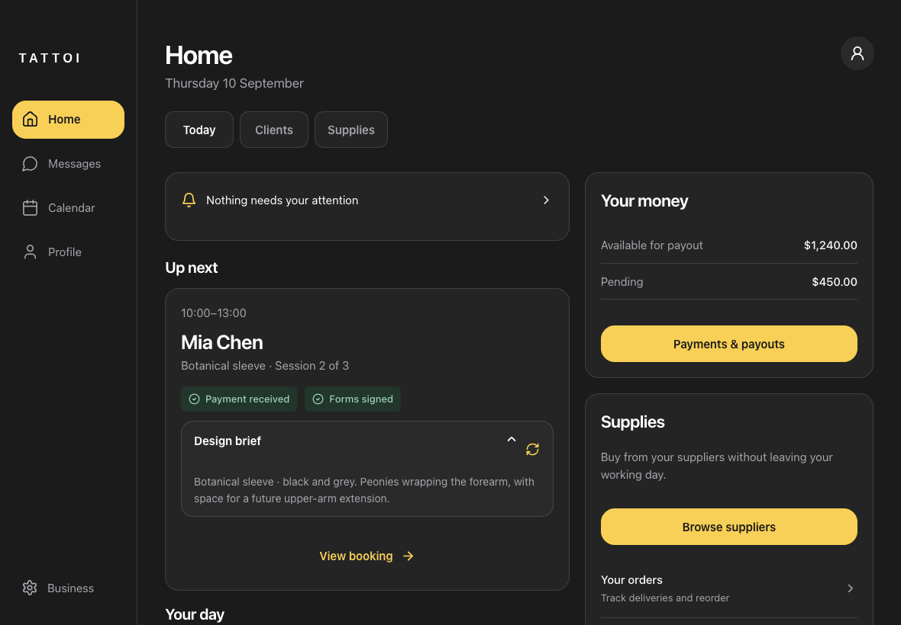
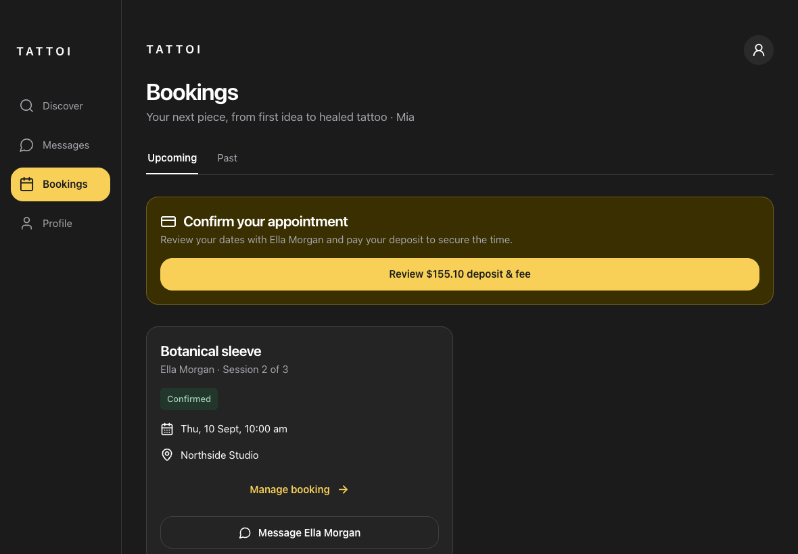
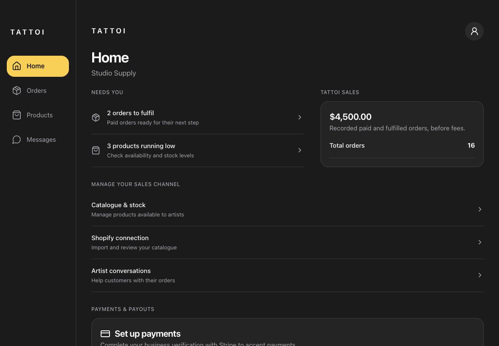

# Tattoi workflow launch · 3.1.0

Branch: `codex/tattoi-workflow-launch`.

This branch applies the approved original-palette design to the real application. It retains the existing authenticated APIs and payment components; it does not use prototype data in the app.

## What changed

- Original role navigation: artist Home/Messages/Calendar/Profile; client Discover/Messages/Bookings/Profile; supplier Home/Orders/Products/Messages. All three use a side rail on iPad.
- Artist Home has Today/Clients/Supplies sections, attention tasks, a real conversation design brief, payout balances and supplier access.
- Calendar uses a virtual, continuously scrolling day timeline. The current date follows scrolling; the window recentres when approaching either end. Compact/expanded agenda modes preserve the selected date. Existing artist and studio calendar queries, booking details, forms and session actions remain connected.
- New booking is a guided client → saved service → automatic frequency/date suggestions → review/send flow. Single sittings and manual edits remain supported. Plans use the existing availability and session-plan endpoints.
- Messages retain previews and real messaging/attachments. Artist conversations show the design brief. Wide iPads show the conversation list, thread, session context and private notes together. Phone threads give the composer its own fixed-height workspace. Failed note saves preserve the draft; phone/iPad layout changes share the same draft.
- Client intake is six steps: idea/style, placement/timing, reference images, placement photo, contact details, review. Password creation only appears after successful submission. Existing users keep the existing sign-in/claim flow. The preferred timeframe is included in the submission.
- Client booking cards and supplier management use the shared cool-grey, charcoal and yellow palette, surfaces and responsive navigation. Supplier Home links directly to fulfilment, stock, Shopify management, messages and payments.
- Removed launch navigation into artist product selling/events and the deferred portfolio-management tour. Supplier product selling and artist purchasing remain available. Existing portfolio imagery can still appear on public profiles.

## Device testing

1. In the existing Railway service, select this branch as the source branch and deploy its latest commit. Use the service/environment intended for testing.
2. Keep the service’s existing domain and environment configuration. This change adds no required environment variables or database migrations.
3. Once Railway reports a healthy deployment, open that service’s HTTPS URL in Safari on iPhone or iPad.
4. For an installed PWA on that same domain, open it and accept the update prompt if shown. Close and reopen it if an older screen remains. A PWA installed from a different domain will continue to use that domain.
5. Sign in separately as an artist, client and supplier. Check Calendar → New booking; Messages → design brief/notes; client booking request through the artist link; supplier Orders/Products and artist Supplies.

Committing this branch does not itself deploy Railway or update an installed PWA.

## Verification

- TypeScript check passed.
- Existing suite: 42 test files, 166 tests passed.
- Frontend production bundle and service worker built; server bundle and migration assets built.
- 78 browser viewport cases: three roles, iPhone 440×956, iPad landscape 1180×820 and portrait 820×1180, in light and dark modes. No page errors, blank pages or horizontal overflow. Simulated safe-area insets were applied.
- Follow-up cases checked the final surfaces. Six dedicated calendar cases verified compact/expanded agenda date anchoring, scrolling between months and returning to Today after the final fixes.
- The six-step intake submitted its timeframe and only then presented password creation.
- Failed private-note save, retry, draft retention across viewport changes and submission of a three-sitting proposal passed.

Browser checks intercept API responses with isolated fixtures. They verify frontend behaviour and request payloads, not a live Stripe/Shopify/Railway end-to-end transaction. Physical-device Safari testing remains the purpose of this branch. Existing fee rules, Stripe configuration and Shopify inventory-sync behaviour are unchanged.

Reproducible browser scripts: `scripts/ui-audit/launch-check.mjs`, `launch-intake-check.mjs`, and `launch-interaction-check.mjs`. Start Vite, then set `AUDIT_URL`, `PLAYWRIGHT_PATH` and optionally `AUDIT_BROWSER`/`AUDIT_OUTPUT` for your environment.

## Screenshots

These are screenshots of the actual frontend with isolated fixture data, not live customer records.

